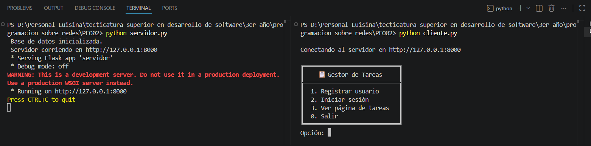
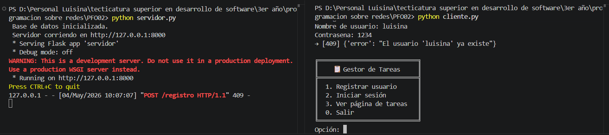
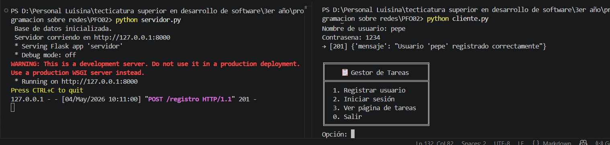
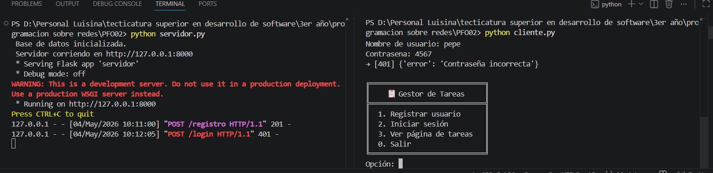
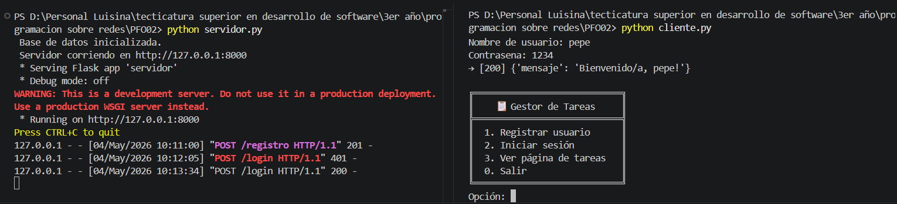
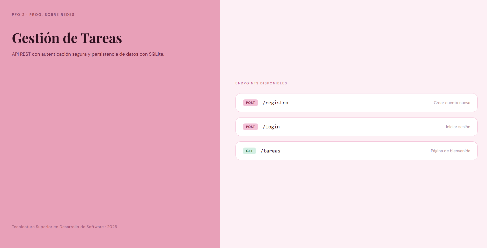

# PFO02
Segunda práctica formativa obligatoria para la materia Programación sobre redes
API REST construida con **Flask** y **SQLite**, con autenticación de usuarios y contraseñas hasheadas con **bcrypt**.

---

## 🚀 Instalación y ejecución

### 1. Clonar el repositorio

```bash
git clone https://github.com/luisimuller/PFO02.git
cd PFO02
```

### 2. Instalar dependencias

```bash
pip install flask bcrypt requests
```

### 3. Iniciar el servidor

```bash
python servidor.py
```

Deberías ver:
```
 Base de datos inicializada.
 Servidor corriendo en http://127.0.0.1:8000
* Running on http://127.0.0.1:8000
```

### 4. Usar el cliente de consola (en otra terminal)

```bash
python cliente.py
```

>  El servidor debe seguir corriendo en la primera terminal mientras usás el cliente.

---

##  Endpoints de la API

### `POST /registro`

Registra un nuevo usuario con contraseña hasheada.

**Body (JSON):**
```json
{
  "usuario": "luisina",
  "contrasena": "1234"
}
```

**Respuesta exitosa (201):**
```json
{
  "mensaje": "Usuario 'luisina' registrado correctamente"
}
```

**Errores posibles:**
- `400` — Faltan campos requeridos
- `409` — El usuario ya existe

---

### `POST /login`

Verifica las credenciales del usuario.

**Body (JSON):**
```json
{
  "usuario": "luisina",
  "contrasena": "1234"
}
```

**Respuesta exitosa (200):**
```json
{
  "mensaje": "Bienvenido/a, luisina!"
}
```

**Errores posibles:**
- `404` — Usuario no encontrado
- `401` — Contraseña incorrecta

---

### `GET /tareas`

Devuelve una página HTML de bienvenida con información del sistema y los endpoints disponibles.

Abrí en el navegador: `http://127.0.0.1:8000/tareas`

---

##  Pruebas con PowerShell

```powershell
# Registrar usuario
Invoke-RestMethod -Uri "http://127.0.0.1:8000/registro" -Method POST -ContentType "application/json" -Body '{"usuario": "luisina", "contrasena": "1234"}'

# Login correcto
Invoke-RestMethod -Uri "http://127.0.0.1:8000/login" -Method POST -ContentType "application/json" -Body '{"usuario": "luisina", "contrasena": "1234"}'

# Login con contrasena incorrecta
Invoke-RestMethod -Uri "http://127.0.0.1:8000/login" -Method POST -ContentType "application/json" -Body '{"usuario": "luisina", "contrasena": "incorrecta"}'
```

---

##  Estructura del proyecto

```
pfo2-gestor-tareas/
├── servidor.py      # API Flask + SQLite
├── cliente.py       # Cliente de consola interactivo
├── README.md        # Este archivo
└── tareas.db        # Base de datos SQLite (se crea automáticamente)
```

---
##  Captura de pantallas de la ejecución del Cliente-Servidor








---
##  Respuestas de preguntas teóricas

## ¿Por qué hashear contraseñas?
Porque guardar contraseñas en texto plano es muy peligroso. Si alguien accede a la base de datos, vería todas las contraseñas directamente. El hasheo convierte la contraseña en una cadena irreversible, lo que significa que aunque roben la base de datos, no pueden recuperar la contraseña original.

## Ventajas de usar SQLite en este proyecto
Sin servidor: No necesita instalación ni configuración de un motor de base de datos externo. Todo funciona desde el mismo archivo.
Un solo archivo: Toda la base de datos vive en tareas.db, lo que lo hace fácil de mover, respaldar o eliminar.
Integrado en Python: El módulo sqlite3 viene incluido en Python por defecto, sin necesidad de instalar nada extra.